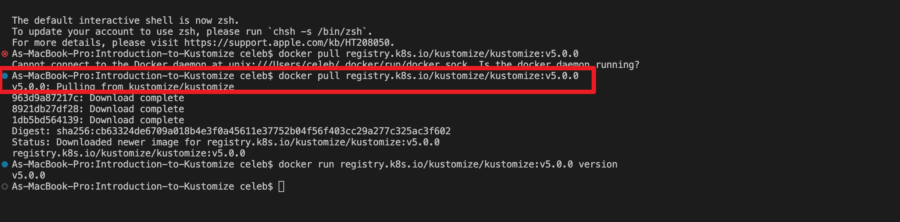
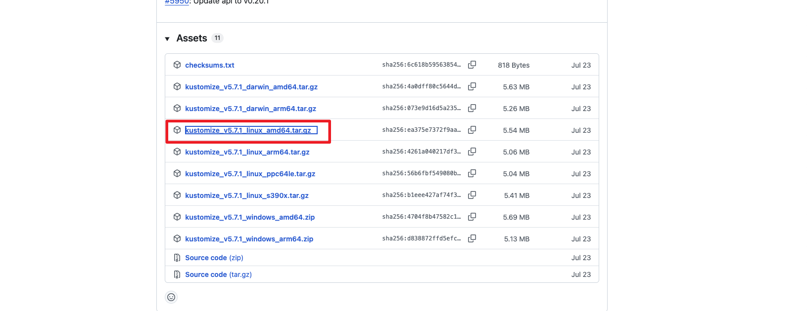
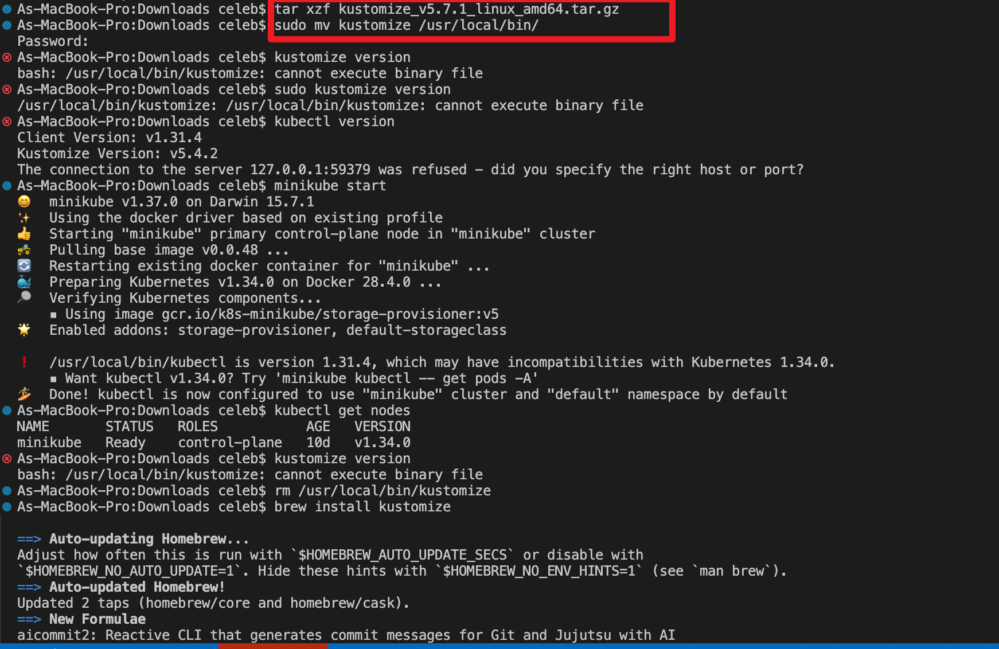
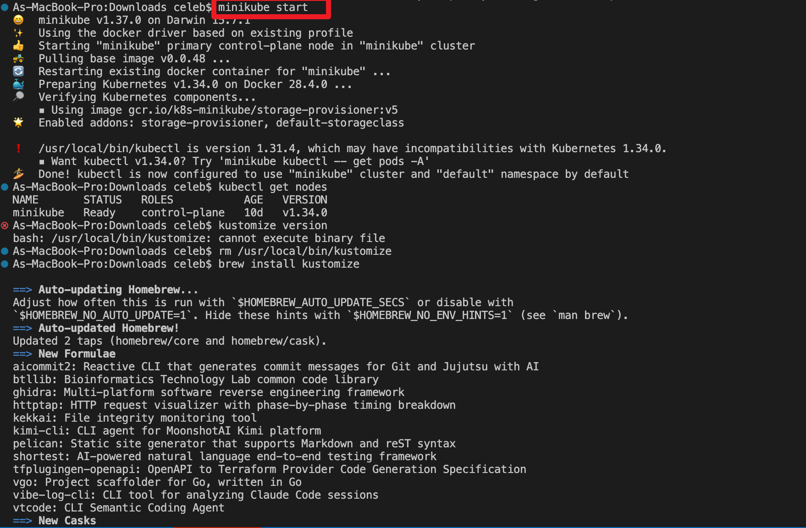

# Introduction to Kustomize
##  Project: Introduction to Configuration Management in Kubernetes with Kustomize
### Introduction
This project is designed to provide hands-on experience and a deep understanding of how Kustomize revolutionizes configuration management in Kubernetes environments.
As Kubernetes continues to dominate the cloud-native ecosystem, mastering tools like Kustomize is essential for every DevOps engineer.

Through this project, you will progress from understanding basic Kubernetes configurations to exploring the advanced functionalities of Kustomize — equipping you with skills that are highly valuable in today’s tech landscape.

### Lesson 1.1: Understanding Kubernetes Configuration
#### Objectives
* Familiarize yourself with Kubernetes objects and configurations.
### Tasks and Detailed Steps
1. Explore Kubernetes Documentation
* Visit the Kubernetes Objects Overview.[Kubernetes Documentation](https://kubernetes.io/docs/concepts/overview/working-with-objects/)
* Read about key components such as Pods, Deployments, Services, and ConfigMaps.

2. Write a Sample YAML File
Create a file named mypod.yaml and insert the following content:

```apiVersion: v1
kind: Pod
metadata:
  name: mypod
spec:
  containers:
  - name: mycontainer
    image: nginx
```
**Explanation:**
This YAML defines a Kubernetes Pod named mypod containing a single container running the NGINX image.


3. Discussion
Reflect on the importance of managing configurations consistently — especially as your Kubernetes environment scales and becomes more complex.

### Lesson 1.2: Introduction to Kustomize
#### Objectives
* Understand Kustomize’s role in Kubernetes configuration management.

### Tasks and Detailed Steps
1. Watch a beginner-friendly video or read an article about **Kustomize**.

Recommended: [Introduction to Kustomize](https://kubernetes.io/docs/tasks/manage-kubernetes-objects/kustomization/)

2. Key Points to Understand:

* Kustomize provides a declarative approach to managing Kubernetes objects.
* It allows you to maintain multiple environments (e.g., dev, staging, prod) with ease.
* It eliminates the need for templates, focusing instead on patching and overlays.

### Lesson 1.3: Setting Up the Environment
#### Objectives
* Install Kustomize and set up a basic Kubernetes cluster using Minikube.

#### Task 1: Install Kustomize
**What is Kustomize?**
Kustomize is a tool that allows you to **customize raw, template-free YAML files** for multiple purposes — an essential capability in Kubernetes deployments.

#### Detailed Steps for Linux
1. Visit the Kustomize GitHub Releases Page.

2. Select the appropriate version for your system.

3. Download the .tar.gz file.



4. Open your terminal.

5. Navigate to the download directory.

6. Extract the file:

```tar xzf kustomize_vX.Y.Z_linux_amd64.tar.gz```

Replace X.Y.Z with the version number you downloaded.
This command extracts the kustomize executable.

7. Move the extracted file to a directory in your system PATH:

```sudo mv kustomize /usr/local/bin/```



8. Verify the installation:

```kustomize version```
You should see the installed version displayed in the terminal.


#### Task 2: Set Up a Mini Kubernetes Cluster with Minikube
1. Install Minikube
Follow the installation instructions from the [Minikube documentation](https://minikube.sigs.k8s.io/docs/start/?arch=%2Fmacos%2Fx86-64%2Fstable%2Fbinary+download).

2. Start Minikube

```minikube start```


3. Verify Minikube Installation

``kubectl version --client``

``minikube status``

4. Verify Kustomize Installation (Optional)

``kustomize version``


### Conclusion
By completing this project, you’ve:

* Gained hands-on experience with Kubernetes configuration files.
* Understood how Kustomize simplifies managing multiple environments.
* Set up a working Minikube cluster for testing configurations.

This foundation prepares you for advanced configuration management and automation projects within the Kubernetes ecosystem.

### Author
Project by: Samson Bakare
Tooling: Kubernetes, Minikube, Kustomize, YAML
